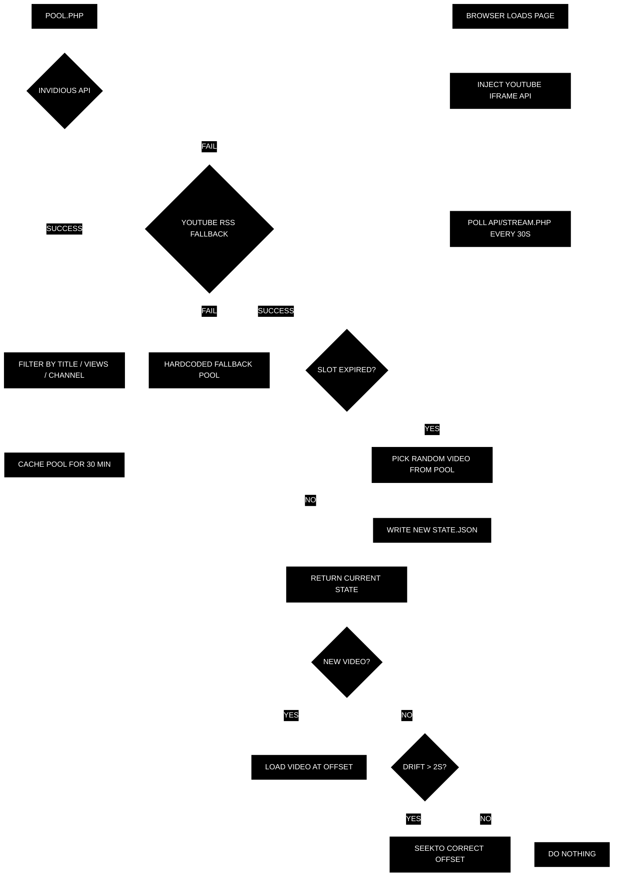

# As I Was Bingeing Ahead Occasionally I Saw Brief Glimpses of Beauty

a synchronized global video stream artwork inspired by jonas mekas' [5-hour home-movie film](https://en.wikipedia.org/wiki/As_I_Was_Moving_Ahead_Occasionally_I_Saw_Brief_Glimpses_of_Beauty) and the culture of [binge-watching](https://en.wikipedia.org/wiki/Binge-watching). an endless sequence of random youtube videos plays in sequence — like channel-zapping through the intimate and mundane moments captured by strangers around the world. all visitors worldwide see the same video at the same moment.

## how it works?

the server picks a random amateur video every 5 minutes from a pool of ~30 candidates fetched via the invidious api. every client polls the server every 30 seconds and computes the same playback offset from a shared utc timestamp — no websockets, no firebase, no api keys at runtime.

```
offset = (Date.now() - startedAt) / 1000
player.seekTo(offset, true)
```



## video curation

videos are sourced using the [img_0001 approach](https://walzr.com/IMG_0001) — searching for default camera filenames (`IMG_0001`, `VID_20230`, `MOV_0001`) to find genuinely amateur uploads. results are sorted by upload date (not relevance) to avoid seo-optimized content, and filtered through a multi-signal pipeline:

- **title blocklist** — 50+ terms across music, education, gaming, commercial, news, fitness, tech, and ambient categories
- **channel blocklist** — filters professional/corporate channel names (news, media, official, studios, etc.)
- **view count ceiling** — excludes videos with >50,000 views to favor genuine amateur content
- **invidious api** — `sort_by=upload_date`, `duration=medium`, pages 1-5 randomized

all filters and thresholds are centralized in `pool.php → getConfig()` for easy tuning.

## project structure

```
public/
├── index.html              # minimal shell
├── css/style.css           # house style (black, roboto, glitch animation)
├── js/app.js               # youtube iframe + stream polling
└── api/
    ├── stream.php           # state manager (file-locked, rate-limited)
    ├── pool.php             # video fetcher (invidious + rss + filters)
    ├── utils.php            # shared utilities (ip detection)
    ├── perf.php             # performance logging
    ├── rate-limit.php       # ip-based rate limiting
    └── .htaccess            # block direct .json access
```

runtime files (gitignored): `state.json`, `pool-cache.v*.json`, `logs/`

## deployment

push to `master` triggers github actions → ftp deploy `public/` to cpanel. requires repository secrets: `FTP_SERVER`, `FTP_USERNAME`, `FTP_PASSWORD`.

```bash
git push origin master
```

verify: visit `api/stream.php` directly — should return `{ videoId, startedAt, slotDuration }`. open in two tabs — both should show the same video at the same position.

## configuration

all tunable values live in two files:

| setting | file | default |
|---|---|---|
| slot duration | `stream.php` → `SLOT_DURATION` | 300s (5 min) |
| cache version | `stream.php` → `POOL_CACHE_VERSION` | `'3'` |
| rate limit | `stream.php` → `RateLimiter::configure()` | 100 req/min/ip |
| pool size | `pool.php` → `getConfig()` → `pool_size` | 30 videos |
| view count ceiling | `pool.php` → `getConfig()` → `max_view_count` | 50,000 |
| search queries | `pool.php` → `getConfig()` → `search_queries` | ~45 queries |
| title blocklist | `pool.php` → `getConfig()` → `title_blocklist` | 50+ terms |
| channel blocklist | `pool.php` → `getConfig()` → `channel_blocklist` | 8 terms |
| invidious instances | `pool.php` → `getConfig()` → `invidious_instances` | 7 instances |

## technical notes

- **zero youtube api quotas** — invidious api, youtube rss feeds, and youtube iframe player api are all free
- **file-locked state** — `flock()` prevents race conditions on `state.json` under concurrent requests
- **rate-limited** — ip-based request limiting with file locking to prevent toctou races
- **clock skew** — utc timestamps; typical skew < 1s across devices, acceptable for an art piece
- **ios autoplay** — requires user gesture; a tap-to-start gate is available in the html

## testing

```bash
# php
composer install --dev
vendor/bin/phpunit

# javascript
npm install --save-dev jest babel-jest
npm test
```

## troubleshooting

| problem | fix |
|---|---|
| `stream.php` returns error | ensure `public/api/` is writable (755 for dirs, 644 for files) |
| only fallback videos | invidious instances may be down; check `logs/perf.log` |
| videos not syncing | verify `api/stream.php` returns json; check browser console |

## license

licensed under [apache 2.0](LICENSE).
vibe coded by [leandro estrella](https://leandroestrella.com).
